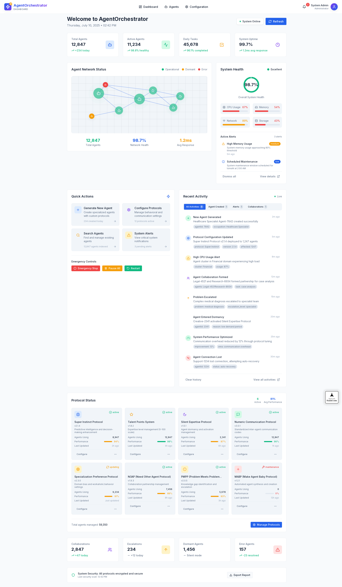
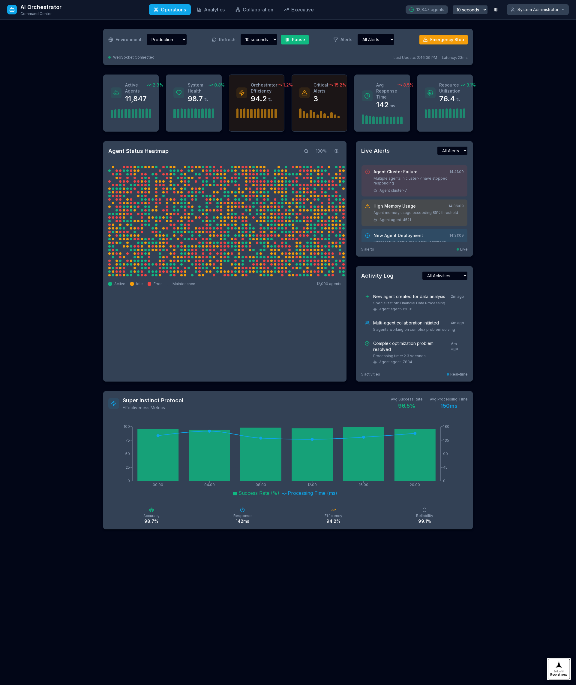
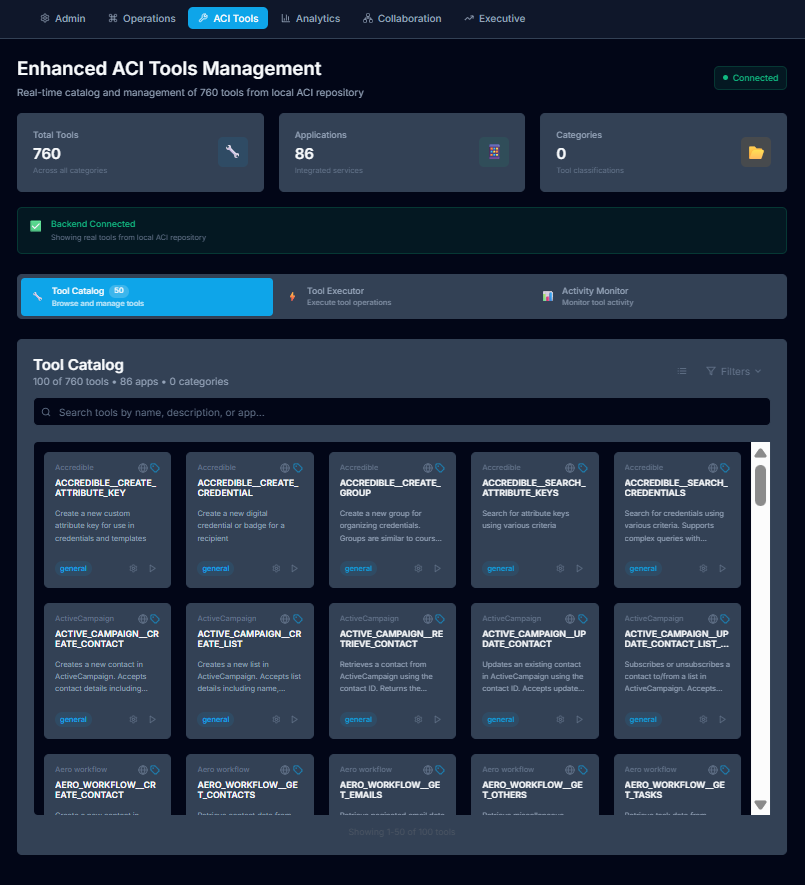

Copy code

  <h1>Project Chimera</h1>
  <h3>A Blueprint for a Perpetual AGI Ecosystem</h3>

  
  
  

---

## 🧠 Introduction

**Project Chimera** is a comprehensive blueprint for cultivating a **perpetual AGI (Artificial General Intelligence) ecosystem**—an intelligence that evolves, learns, and self-regulates autonomously. Unlike brittle tools of narrow AI, Chimera aspires to build a **living system** that can tackle humanity’s most complex challenges across generations.

Its core premise is holistic integration: cognition, ethics, and governance are not modular features but a **synergistic, interlocking system**. This design ensures both power and safety—intelligence governed by **a decentralized, human-led oversight body**, guaranteeing alignment with our long-term collective interests.

> _“Project Chimera is not a menu of features to be picked apart... Its power and safety derive from its holistic nature.”_

---

## 📺 Live Operational Prototype: The AI Orchestrator

> ⚠️ **Note:** All data displayed in current dashboards is **mocked** and intended for **demonstration purposes only**.

- ### ► [Live Agent Orchestrator Dashboard](https://agentorchestrator-dashboard-zpw2m51.public.builtwithrocket.new)
  Real-time, high-level view of the **Multi-Agent Ecosystem (MAE)**, monitoring health, activity, and status of over 12,000+ autonomous agents.

  

- ### ► [Live AI Orchestrator Heatmap & Alerts](https://ai-agent-orchestrator-dashboard-131tb56.public.builtwithrocket.new/)
  A deeper look at operational dynamics including **agent-level alerts**, **heatmaps**, and critical safety functions such as the **Emergency Stop**.

  

- ### ► [Live ACI Tools Management Dashboard](https://aci-tools-management-dashboard-zpw2m52.public.builtwithrocket.new)
  Real-time catalog and management of **760 tools** from the local **Advanced Cognitive Infrastructure (ACI)** repository, available to the **12,000+ agents** to execute complex, specialized tasks.

  

---

## 🧬 Core Architectural Components

Project Chimera’s architecture is designed as a **unified cognitive ecosystem**, where each layer supports and enhances the others.

### 🧩 Tiered Cognitive Cycle (TCC)
A neuro-symbolic reasoning engine that enables autonomous agents to think, learn, and act through recursive internal processing.

### 🧠 Simulated Intervention Environment (SIE)
A “computational imagination” engine allowing agents to simulate counterfactual scenarios and build causal understanding of their environment.

### 🧬 Agent Synthesis Engine (ASE)
Creates new agents on demand to fill strategic capability or knowledge gaps, enabling **organic evolution** of the system.

### 🗳 Hybrid "Proof-of-Brain" Governance
A decentralized governance layer prioritizing **expertise over capital**, ensuring decisions remain ethically sound and value-aligned.

---

## 📚 The Data Room: Strategic, Technical, and Ethical Foundations

The documents below form the **complete, interdependent foundation** of Project Chimera. For a full understanding, review them in order:

| # | Document | Description |
|--:|----------|-------------|
| 1 | `00_Manifesto_for_Project_Chimera.pdf` | Vision, philosophy, and context for the project. |
| 2 | `01_The_Cipher_Architecture_Blueprint.pdf` | Technical blueprint outlining TCC, MAE, and core breakthroughs. |
| 3 | `02_Constitutional_Principles_&_Ethical_Framework.pdf` | The ethical foundation—the “soul” of the AGI ecosystem. |
| 4 | `03_Product_Requirements_Document_(PRD).pdf` | Detailed functional specs that translate vision into systems. |
| 5 | `04_Phased_Development_&_Implementation_Roadmap.pdf` | Strategic 15-year rollout from R&D to ecosystem-scale AGI. |
| 6 | `05_Chimera_AGI_Competitive_Analysis.pdf` | Comparative analysis of Chimera’s approach versus the state of the art. |

---

## 🧱 Foundational Code & Repositories

### 🔧 Technical Architecture Repository  
Contains detailed specifications, reference models, and exploratory work on the cognitive architecture and agent orchestration systems.

### 🧪 Foundational Prototype (CodeMAD)  
An experimental codebase that seeded the **Multi-Agent Ecosystem (MAE) v1.0**, laying the groundwork for agent orchestration, synthesis, and simulation.

---

## 🌐 Visionary Contribution

> _"I offer this work to the open community of thinkers, builders, and pioneers..."_

Project Chimera is more than just a technology stack—it is a **philosophical and systemic rethink** of artificial intelligence. The **neuro-symbolic engine**, the **causal simulation layer**, the **agent synthesis protocols**, and the **governance mechanisms** are deeply interconnected. Their interdependence is the source of both **robustness** and **ethical integrity**.

---

## 📦 Installation & Usage (Coming Soon)

Installation scripts and hands-on usage guides will be provided after core stabilization in the next development phase.

---

## 🛠 Troubleshooting

- Ensure required dependencies (e.g. simulation mocks, dashboard servers) are correctly mounted.
- For visual glitches, clear browser cache or disable ad-blockers.
- Use Chromium-based browsers for optimal dashboard rendering.

---

## ⭐ Stay Connected

Star this repository to support the mission and receive updates:

  <a href="https://github.com/Alex-Cipher-AI/cognitive-architecture-concept/stargazers">
    
  </a>

---

## 📬 How to Contribute

Join us in shaping the future of intelligence:

- 💬 Open issues to spark discussion or propose ideas.
- 🔧 Submit pull requests for improvements, bug fixes, or design contributions.
- 📄 See `CONTRIBUTING.md` (coming soon) for contribution guidelines.

---

## 🛡 License

This project is licensed under the **AGI Constitutional Framework**, a custom license rooted in ethical principles.  
For full terms, refer to: `02_Constitutional_Principles_&_Ethical_Framework.pdf`.

---

> _“The mind once stretched by a new idea, never returns to its original dimensions.” — Ralph Waldo Emerson_
